<p align="center">
  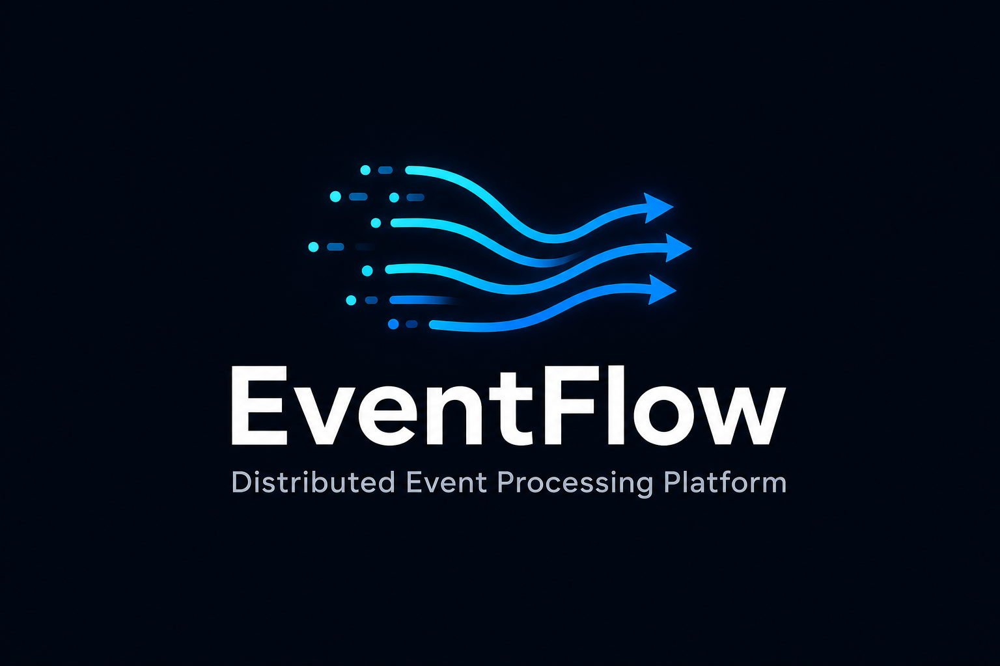
</p>

<h1 align="center">EventFlow</h1>

<p align="center">
  <strong>A production-grade distributed event processing platform — Kafka ingestion, saga workflows, retries, DLQ, replay, and cloud-native observability.</strong>
</p>

<p align="center">
  <a href="#quick-start">Quick Start</a> ·
  <a href="#live-demo">Live Demo</a> ·
  <a href="#architecture">Architecture</a> ·
  <a href="docs/case-study.md">Case Study</a> ·
  <a href="docs/recruiter-guide.md">Recruiter Guide</a>
</p>

<p align="center">
  
  
  
  
  
  
  
  
  
  
</p>

---

## Elevator Pitch

**EventFlow** is an open-source event platform that ingests messages through Kafka, orchestrates multi-step sagas with compensation, retries transient failures with exponential backoff, quarantines poison messages in a dead-letter queue, and replays them on demand — with Prometheus metrics, Grafana dashboards, and Terraform/Helm deployment to AWS.

---

## Live Demo

```powershell
# Full stack + 9-act live demo (~80s) — real APIs, real Kafka, real DLQ
.\scripts\demo.ps1

# Re-run demo if stack is already up
.\scripts\demo.ps1 -SkipStackStart
```

<p align="center">
  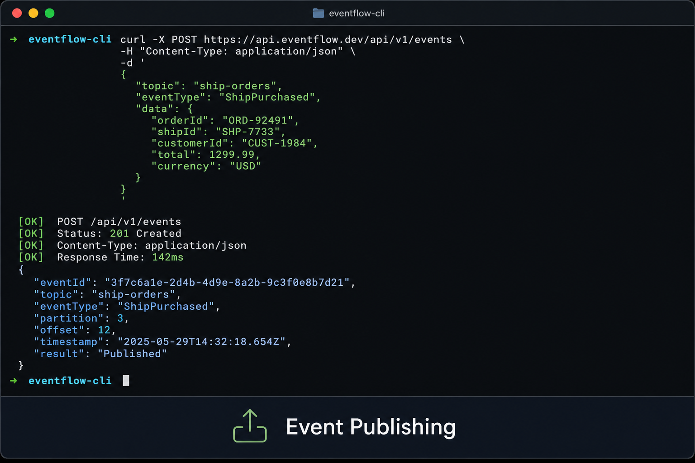
  <br />
  <em>ShipPurchased → Saga → Retry → DLQ → Replay → Success. <a href="docs/demo/demo-script.md">Full script</a> · <a href="docs/assets/generate-gifs.md">Record a GIF</a></em>
</p>

---

## Architecture

<p align="center">
  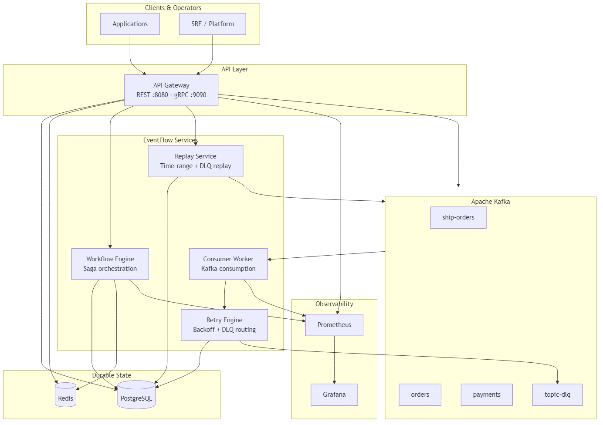
</p>

| Layer | Components |
|-------|------------|
| **Ingress** | API Gateway — REST `:8080`, gRPC `:9090` |
| **Messaging** | Apache Kafka — partitioned topics + DLQ topics |
| **Processing** | Consumer Workers — consumer groups, offset tracking |
| **Orchestration** | Workflow Engine — saga steps + LIFO compensation |
| **Reliability** | Retry Engine — exponential backoff → DLQ routing |
| **Recovery** | Replay Service — DLQ and time-range replay |
| **State** | PostgreSQL (durable) + Redis (locks, idempotency) |
| **Observability** | Prometheus `:9091` + Grafana `:3000` |

<details>
<summary>Additional diagrams</summary>

| Diagram | Description |
|---------|-------------|
| [Workflow Engine](docs/diagrams/workflow-engine.png) | Saga state machine |
| [Retry & DLQ](docs/diagrams/retry-dlq.png) | Failure handling flow |
| [Event Replay](docs/diagrams/event-replay.png) | Replay sequence |

Re-render: `.\scripts\render-diagrams.ps1`

</details>

---

## Core Features

| Feature | Description |
|---------|-------------|
| **Topic Administration** | Create, list, delete Kafka topics via REST/gRPC |
| **Event Publishing** | Single + batch publish, idempotency keys, Snappy compression |
| **Consumer Groups** | Partition assignment, offset commits, at-least-once delivery |
| **Workflow Sagas** | Multi-step processes with compensating transactions |
| **Retry Engine** | Exponential backoff, configurable max attempts |
| **Dead Letter Queue** | `{topic}-dlq` with stats and inspection APIs |
| **Event Replay** | DLQ-only, time-range, and partition replay |
| **Observability** | 15+ Prometheus metrics, 2 Grafana dashboards |
| **Cloud Deploy** | Helm chart + Terraform (EKS, MSK, RDS, ElastiCache) |

---

## Demo Screenshots

<table>
  <tr>
    <td align="center">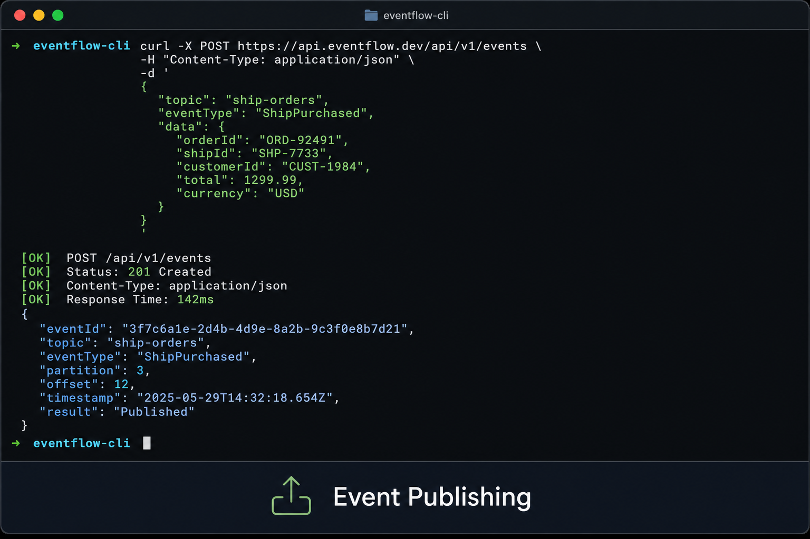<br /><sub>Event Publishing</sub></td>
    <td align="center">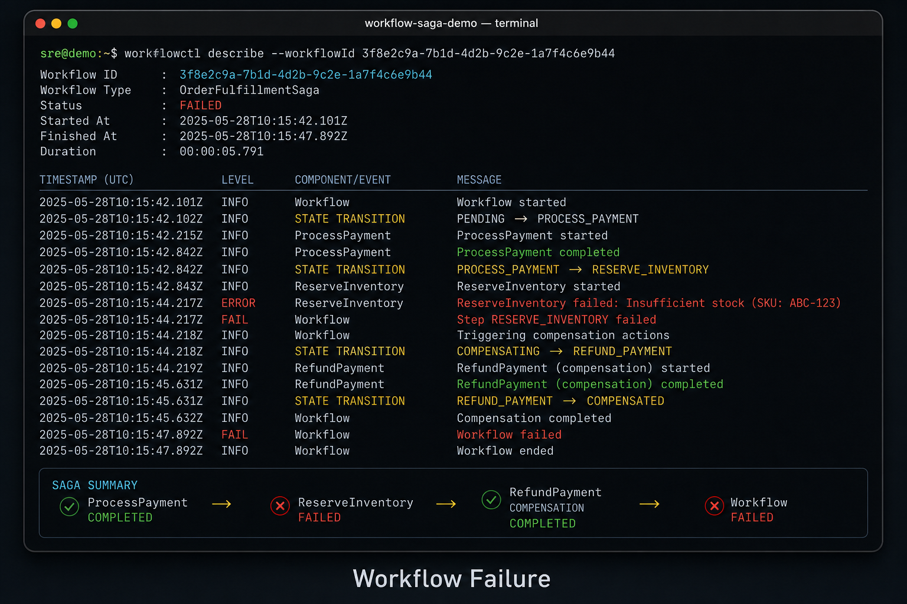<br /><sub>Workflow Failure</sub></td>
    <td align="center">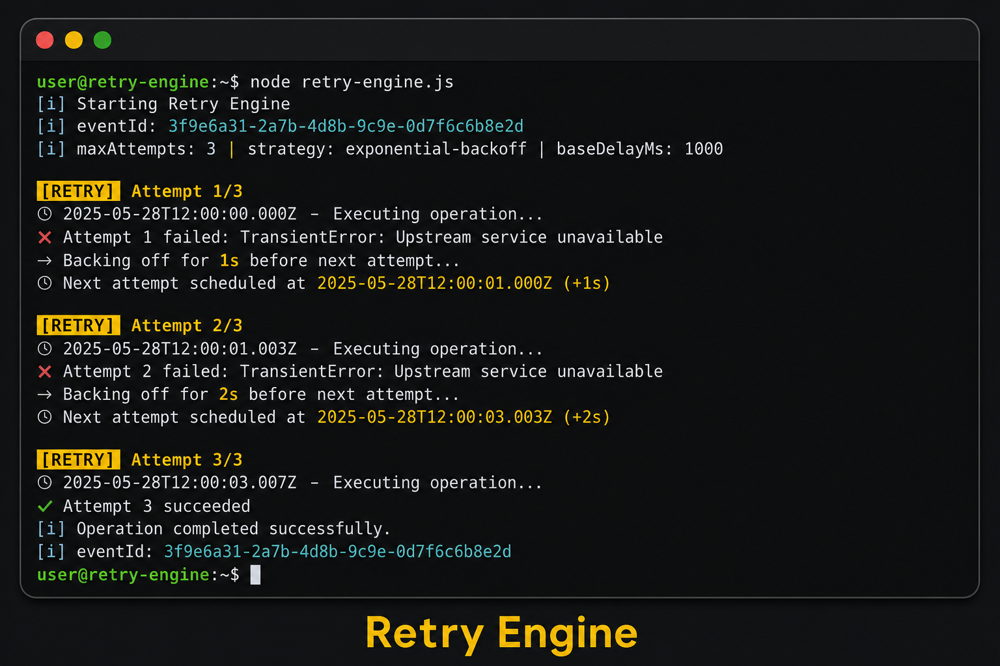<br /><sub>Retry Engine</sub></td>
  </tr>
  <tr>
    <td align="center">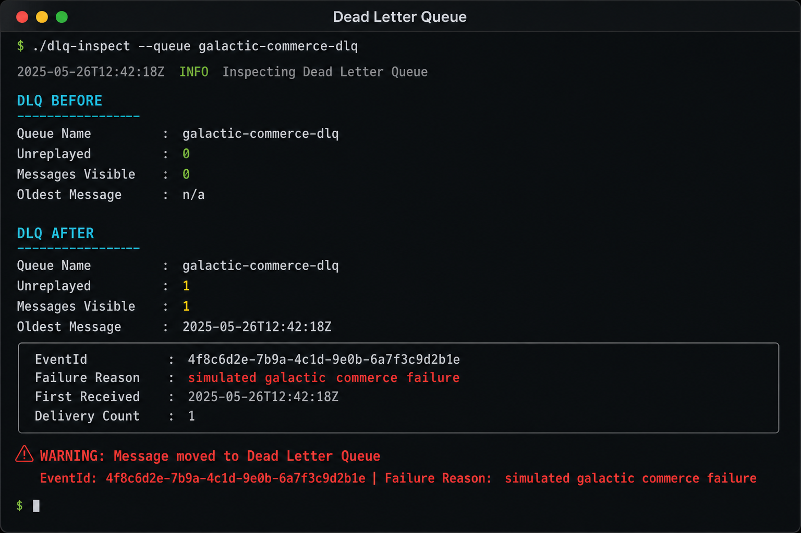<br /><sub>DLQ Insertion</sub></td>
    <td align="center">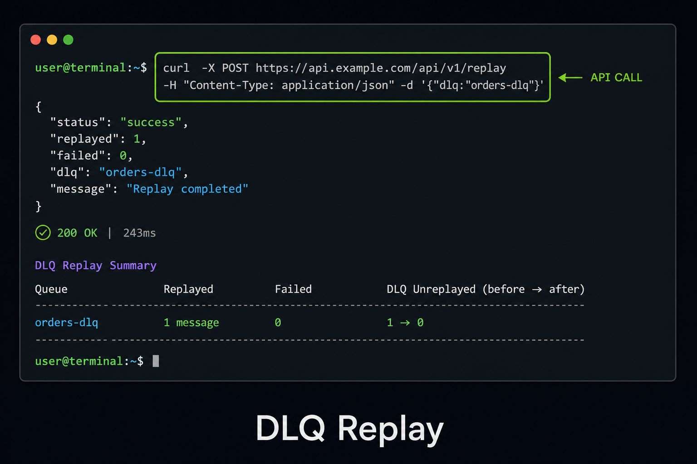<br /><sub>DLQ Replay</sub></td>
    <td align="center">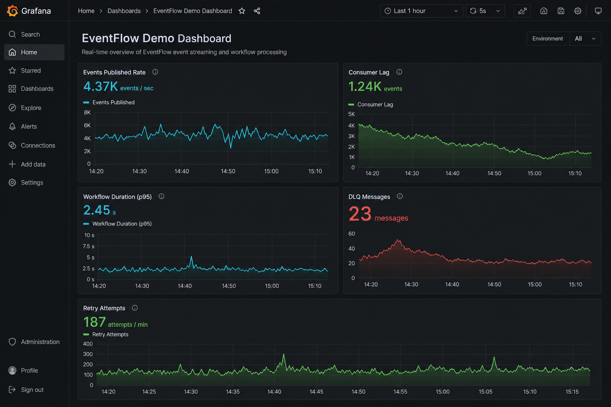<br /><sub>Grafana Dashboard</sub></td>
  </tr>
</table>

---

## Tech Stack

| Category | Technology |
|----------|------------|
| Language | Go 1.22+ |
| Messaging | Apache Kafka (Confluent 7.6) |
| Database | PostgreSQL 16 |
| Cache | Redis 7 |
| API | Gin (REST), gRPC + Protobuf |
| Metrics | Prometheus, Grafana |
| Containers | Docker, Docker Compose |
| Orchestration | Kubernetes, Helm |
| IaC | Terraform (AWS) |
| Testing | Testcontainers, GitHub Actions CI |

---

## Quick Start

### Prerequisites

- Docker Desktop (or Docker Engine + Compose v2)
- Go 1.22+ (for local builds)
- Make (optional)

### Start the platform

```bash
# Start Kafka, PostgreSQL, Redis, all services, Prometheus, Grafana
make docker-up

# Or with Galactic Commerce demo overlay
docker compose -f docker/docker-compose.yml -f docker/docker-compose.demo.yml up -d --wait

# Verify
curl http://localhost:8080/healthz
```

### Service endpoints

| Service | URL | Purpose |
|---------|-----|---------|
| REST API | http://localhost:8080 | Topics, events, workflows, replay |
| gRPC | localhost:9090 | Same operations via gRPC |
| Workflow Engine | http://localhost:8081/metrics | Saga metrics |
| Consumer Worker | http://localhost:8082/metrics | Consumer metrics |
| Prometheus | http://localhost:9091 | Metrics scrape UI |
| Grafana | http://localhost:3000 | Dashboards (`admin` / `admin`) |

---

## Example APIs

### Publish an event

```bash
curl -s -X POST http://localhost:8080/api/v1/events \
  -H "Content-Type: application/json" \
  -d '{
    "topic": "ship-orders",
    "eventType": "ShipPurchased",
    "idempotencyKey": "ship-001",
    "payload": {"pilotId": 42, "shipId": "falcon-x", "credits": 45000}
  }' | jq
```

**Response:**
```json
{
  "id": "6c26f76b-dd6d-4b1b-9c2a-50a7af5a050f",
  "topic": "ship-orders",
  "partition": 3,
  "offset": 1,
  "eventType": "ShipPurchased",
  "publishedAt": "2026-06-09T23:44:02Z"
}
```

### Create a topic

```bash
curl -s -X POST http://localhost:8080/api/v1/topics \
  -H "Content-Type: application/json" \
  -d '{"name":"ship-orders","partitions":6,"replicationFactor":1,"retentionHours":168}' | jq
```

### Inspect consumer offsets

```bash
curl -s http://localhost:8080/api/v1/consumer-groups/galactic-commerce-workers/offsets | jq
```

---

## Workflow Examples

### GalacticCommerce saga

```bash
# Create workflow
WF=$(curl -s -X POST http://localhost:8080/api/v1/workflows \
  -H "Content-Type: application/json" \
  -d '{"name":"GalacticCommerce","input":{"pilotId":42,"shipId":"falcon-x","credits":45000}}' \
  | jq -r '.id')

# Run async
curl -s -X POST "http://localhost:8080/api/v1/workflows/$WF/run" | jq

# Poll status (every second)
curl -s "http://localhost:8080/api/v1/workflows/$WF" | jq '.workflow.status, .steps[].name, .steps[].status'
```

**Steps:** `ProcessPayment` → `ReserveInventory` → `SendConfirmation`

### Inject saga failure (demo)

```bash
curl -s -X POST http://localhost:8080/api/v1/workflows \
  -H "Content-Type: application/json" \
  -d '{"name":"GalacticCommerce","input":{"pilotId":99,"demoFailStep":"ReserveInventory"}}' | jq
```

On failure, **RefundPayment** compensation runs (LIFO rollback).

<p align="center">
  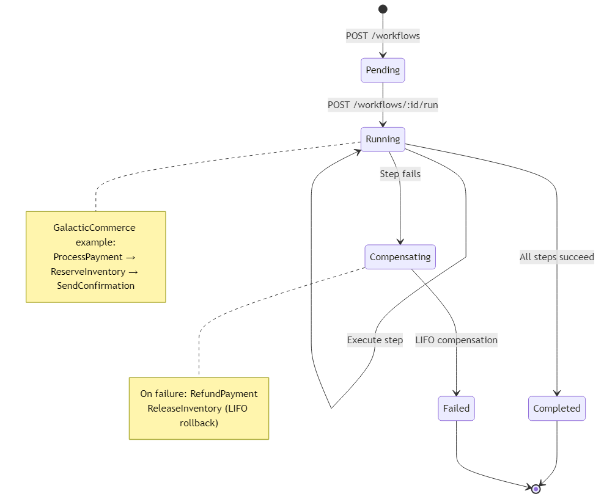
</p>

---

## Retry and DLQ Examples

### Publish a failing event

```bash
curl -s -X POST http://localhost:8080/api/v1/events \
  -H "Content-Type: application/json" \
  -d '{
    "topic": "ship-orders",
    "eventType": "ShipPurchased",
    "idempotencyKey": "toxic-001",
    "payload": {"pilotId": 1, "simulateFailure": true}
  }' | jq -r '.id'
```

### Inspect retries

```bash
curl -s "http://localhost:8080/api/v1/retries?topic=ship-orders&eventId=<EVENT_ID>" | jq
```

### DLQ stats and messages

```bash
curl -s http://localhost:8080/api/v1/dlq/ship-orders/stats | jq
curl -s "http://localhost:8080/api/v1/dlq/ship-orders?limit=5" | jq
```

<p align="center">
  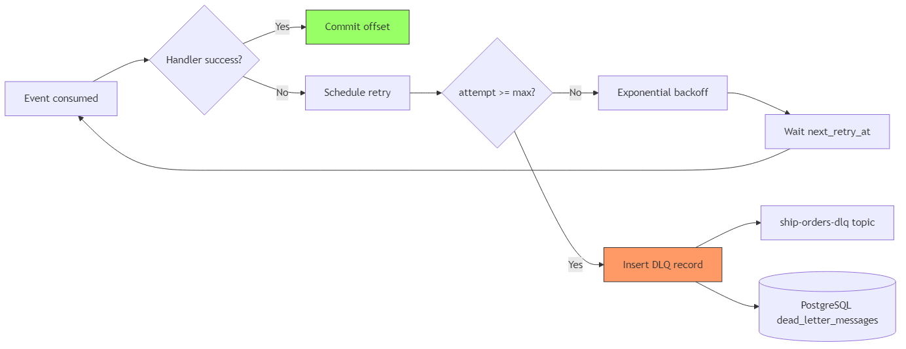
</p>

---

## Replay Examples

```bash
# Replay all unreplayed DLQ messages back to source topic
curl -s -X POST http://localhost:8080/api/v1/replay \
  -H "Content-Type: application/json" \
  -d '{"topic":"ship-orders","dlqOnly":true,"targetTopic":"ship-orders"}' | jq

# Replay by time range
curl -s -X POST http://localhost:8080/api/v1/replay \
  -H "Content-Type: application/json" \
  -d '{
    "topic": "orders",
    "startTime": "2026-01-01T00:00:00Z",
    "endTime": "2026-06-01T00:00:00Z"
  }' | jq
```

<p align="center">
  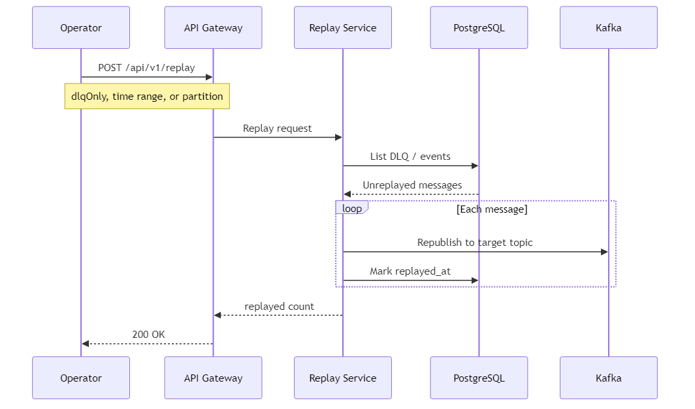
</p>

---

## Monitoring Examples

```bash
# Prometheus targets
open http://localhost:9091

# Grafana demo dashboard (after running demo.ps1)
open http://localhost:3000/d/eventflow-demo/eventflow-demo-dashboard
```

**Key metrics:**

| Metric | Description |
|--------|-------------|
| `eventflow_events_published_total` | Events published per topic |
| `eventflow_events_processed_total` | Consumer throughput |
| `eventflow_consumer_lag` | Partition lag |
| `eventflow_dlq_messages_total` | DLQ insertions |
| `eventflow_retry_attempts_total` | Retry scheduled/failed/dlq |
| `eventflow_workflow_duration_seconds` | Saga step latency |

---

## Repository Structure

```
EventFlow/
├── cmd/                        # Service entrypoints
│   ├── api-gateway/            # REST + gRPC ingress
│   ├── consumer-worker/        # Kafka consumer + retry poller
│   ├── workflow-engine/        # Saga orchestration service
│   └── demo-generator/         # Load / failure injection
├── internal/
│   ├── api/                    # REST handlers
│   ├── grpc/                   # gRPC servers
│   ├── workflow/               # Saga engine
│   ├── retry/                  # Backoff + DLQ routing
│   ├── replay/                 # Replay service
│   ├── storage/                # PostgreSQL + Redis
│   └── topic/                  # Topic administration
├── pkg/                        # Shared: config, kafka, metrics, models
├── api/
│   ├── proto/                  # gRPC definitions
│   ├── gen/go/                 # Generated stubs
│   └── openapi/                # REST OpenAPI spec
├── migrations/                 # PostgreSQL schema
├── docker/                     # Compose + Dockerfiles
├── deployments/
│   ├── k8s/                    # Kubernetes + Kustomize
│   └── monitoring/             # Grafana provisioning
├── helm/eventflow/             # Helm chart
├── terraform/                  # AWS modules (EKS, MSK, RDS, Redis)
├── tests/integration/          # Testcontainers suite
├── docs/
│   ├── diagrams/               # Architecture PNGs
│   ├── demo/                   # Demo script + screenshots
│   ├── case-study.md           # System design write-up
│   ├── recruiter-guide.md      # Non-specialist overview
│   └── resume-snippets.md      # ATS bullet points
└── scripts/                    # demo.ps1, render-diagrams.ps1
```

---

## Design Decisions

| Decision | Rationale |
|----------|-----------|
| **Kafka as event log** | Durable, ordered-per-partition, replayable |
| **PostgreSQL for state** | ACID workflow/retry/DLQ records, queryable by operators |
| **Redis for locks** | Prevent duplicate workflow execution across replicas |
| **At-least-once delivery** | Simpler than exactly-once; idempotency keys compensate |
| **Embedded retry/replay** | Fewer moving parts; invoked from gateway and consumer |
| **Saga over 2PC** | Availability and partition tolerance in distributed deploys |
| **Convention-based DLQ** | `{topic}-dlq` mirrors industry patterns (SQS, Service Bus) |

Full analysis: [docs/case-study.md](docs/case-study.md)

---

## Resume Bullet Points

Copy-ready snippets for different experience levels:

- Built **EventFlow**, a distributed event platform in **Go** with Kafka, saga workflows, exponential retry/DLQ, and replay across **16 REST endpoints** and gRPC
- Engineered **at-least-once delivery** with consumer offset tracking, idempotency keys, and Redis deduplication
- Deployed via **Docker Compose**, **Kubernetes/Helm**, and **Terraform** (AWS EKS, MSK, RDS, ElastiCache)
- Delivered **Prometheus/Grafana** observability and **Testcontainers** integration test suite

More versions: [docs/resume-snippets.md](docs/resume-snippets.md)

---

## Build & Test

```bash
make build              # Build all services
make test               # Unit tests
make test-integration   # Testcontainers (Kafka, Postgres, Redis)
make proto              # Generate gRPC stubs
make helm-install       # Deploy Helm chart
```

---

## Documentation

| Document | Audience |
|----------|----------|
| [Case Study](docs/case-study.md) | Engineers — system design depth |
| [Recruiter Guide](docs/recruiter-guide.md) | Hiring managers — plain language |
| [Project Metrics](docs/project-metrics.md) | Portfolio stats |
| [Demo Script](docs/demo/demo-script.md) | Live presentation |
| [Architecture](docs/architecture.md) | Technical reference |
| [Deployment](docs/deployment.md) | Ops runbook |
| [CHANGELOG](CHANGELOG.md) | v1.0.0 release notes |
| [Recruiter Readiness](docs/recruiter-readiness.md) | Portfolio score: **92/100** |

---

## License

MIT — see [LICENSE](LICENSE).

---

<p align="center">
  <sub>EventFlow v1.0.0 — If this looks like a real distributed systems platform, ⭐ star the repo.</sub>
</p>
