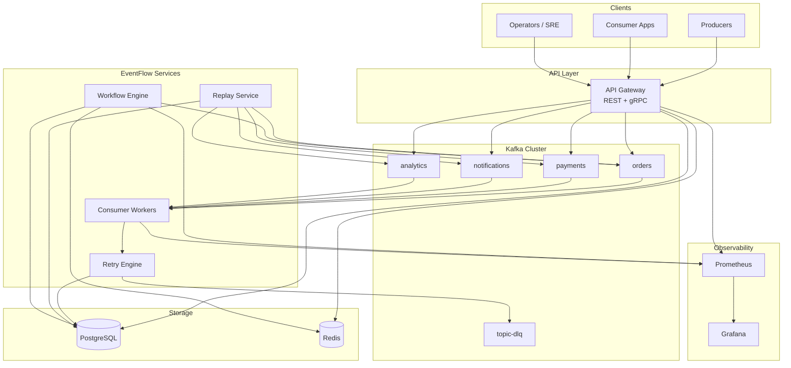
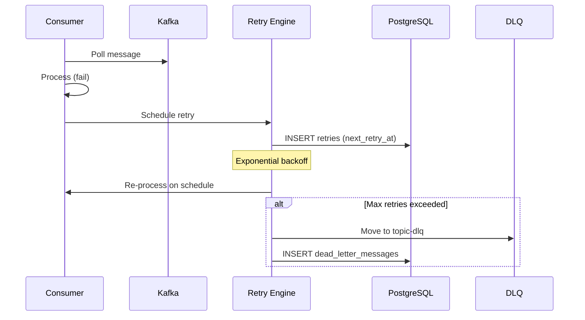
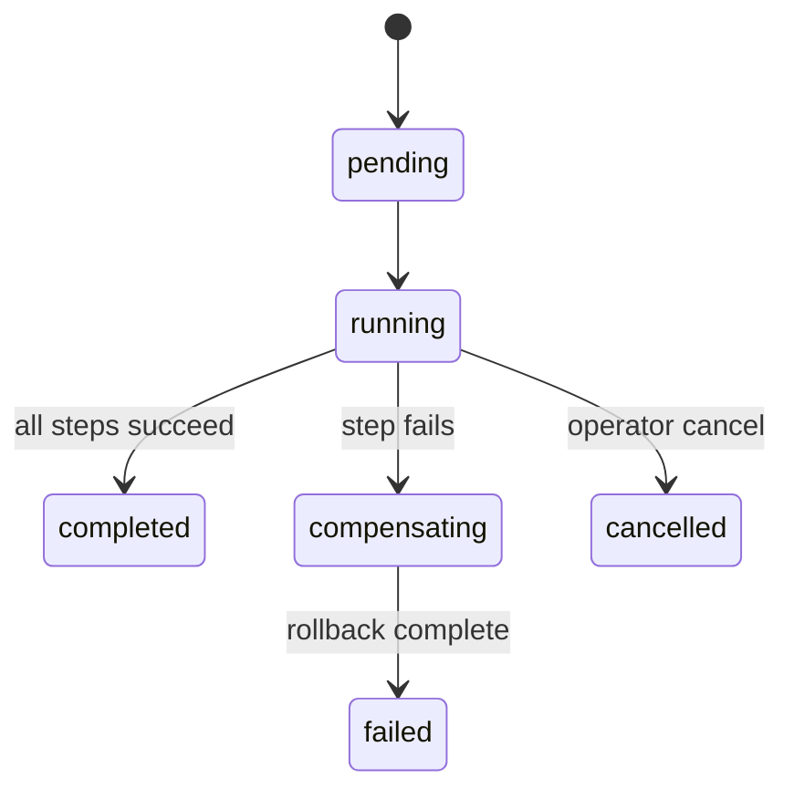
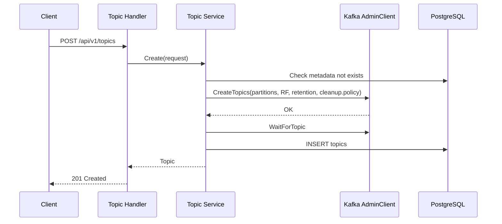

# EventFlow Architecture

EventFlow is a production-grade distributed event processing platform combining durable messaging (Kafka), workflow orchestration (Temporal-inspired), retry/DLQ semantics (SQS-like), and pipeline scheduling concepts (Airflow-inspired).

## High-Level Architecture



## Service Decomposition

| Service | Responsibility | Scaling |
|---------|---------------|---------|
| **api-gateway** | REST/gRPC ingress, topic CRUD, publish, replay API, workflow API | Horizontal (stateless) |
| **consumer-worker** | Kafka consumption, partition assignment, offset commit, handler dispatch | Horizontal per consumer group |
| **workflow-engine** | Saga orchestration, step execution, compensation, state persistence | Horizontal with Redis distributed locks |
| **retry-engine** (embedded) | Exponential backoff, retry scheduling, DLQ routing | Runs in consumer-worker + api-gateway |
| **replay-service** (embedded) | Time-range and DLQ replay | Invoked via api-gateway |

## Kafka Topic Strategy

| Topic | Partitions | Replication | Retention | Purpose |
|-------|-----------|-------------|-----------|---------|
| `orders` | 12 | 3 | 7d | High-throughput order events |
| `payments` | 6 | 3 | 30d | Financial events (longer retention) |
| `notifications` | 3 | 3 | 3d | Ephemeral notification fan-out |
| `analytics` | 24 | 3 | 14d | Analytics pipeline ingestion |
| `{topic}-dlq` | 3 | 3 | 90d | Dead letter storage per source topic |

**Naming convention:** `{domain}` for primary topics, `{domain}-dlq` for dead letters.

## Partitioning Strategy

- **Key-based partitioning:** Use `idempotencyKey` or business key (e.g. `userId`, `orderId`) as Kafka message key for ordering guarantees per entity.
- **orders (12 partitions):** `hash(orderId) % 12` — colocate order lifecycle events.
- **payments (6 partitions):** `hash(paymentId) % 6` — compliance-friendly bounded ordering.
- **analytics (24 partitions):** maximize parallelism; ordering not required.
- **notifications (3 partitions):** low volume, fan-out via consumer groups.

## Consumer Group Design

```
Consumer Group: eventflow-workers
├── Member 1 → partitions [0, 1, 2, 3]
├── Member 2 → partitions [4, 5, 6, 7]
└── Member 3 → partitions [8, 9, 10, 11]
```

- **Rebalancing:** Kafka consumer group coordinator handles partition reassignment on scale-up/down.
- **Offset tracking:** Dual-write to Kafka committed offsets + PostgreSQL `consumer_offsets` for audit/replay.
- **At-least-once:** Manual commit after successful processing; no commit on failure → redelivery.
- **Horizontal scaling:** `replicas ≤ partition count` for maximum parallelism.

## Retry Architecture



**Policy defaults:** 5 attempts, 1s initial backoff, 2x multiplier, 5m max backoff, 30s step timeout.

## Workflow Engine Architecture



**OrderFulfillment saga:**
```
OrderCreated → ProcessPayment → ReserveInventory → SendEmail
                  ↓ compensate      ↓ compensate
              RefundPayment    ReleaseInventory
```

- State persisted in `workflows` + `workflow_steps` tables.
- Redis distributed lock prevents duplicate execution.
- Each step has configurable timeout and optional compensation handler.

## Monitoring Architecture

| Metric | Type | Labels |
|--------|------|--------|
| `events_processed_total` | Counter | topic, consumer_group |
| `events_failed_total` | Counter | topic, consumer_group, reason |
| `consumer_lag` | Gauge | topic, consumer_group, partition |
| `queue_depth` | Gauge | topic |
| `retry_attempts_total` | Counter | topic, status |
| `workflow_duration_seconds` | Histogram | workflow_name, status |

Grafana dashboard: `deployments/monitoring/grafana/dashboards/eventflow.json`

## Deployment Architecture

```
┌─────────────────────────────────────────────────────────┐
│                    AWS (Terraform)                       │
│  VPC → EKS → EventFlow pods                             │
│       → MSK (Kafka)                                     │
│       → RDS (PostgreSQL Multi-AZ)                       │
│       → ElastiCache (Redis)                             │
│       → Prometheus + Grafana (in-cluster)                 │
└─────────────────────────────────────────────────────────┘
```

Local development: `docker compose -f docker/docker-compose.yml up`

## Phase 2: Topic Provisioning Architecture



Topic deletion calls `DeleteTopics` on Kafka then removes PostgreSQL metadata.

## Phase 2: gRPC Architecture

Four services registered on API Gateway port 9090:

| Service | RPCs |
|---------|------|
| `TopicService` | CreateTopic, ListTopics, GetTopic, DeleteTopic |
| `EventService` | PublishEvent, PublishBatch |
| `ReplayService` | ReplayEvents |
| `WorkflowService` | StartWorkflow, RunWorkflow, GetWorkflow |

gRPC reflection enabled for `grpcurl` debugging. Protobuf definitions in `api/proto/eventflow/v1/`, generated code in `api/gen/go/`.

## Phase 2: Test Strategy

| Layer | Tool | Scope |
|-------|------|-------|
| Unit | `go test ./internal/...` | Validation, backoff math |
| Integration | Testcontainers (`-tags=integration`) | Kafka, Postgres, Redis |
| Failure injection | `tests/integration/failure_test.go` | DLQ routing, lock TTL |
| Load | `go test -tags=load ./tests/load/...` | Marshal benchmarks |
| E2E | OrderFulfillment saga in integration tests | Full workflow path |

## Phase 2: Helm Deployment

Chart at `helm/eventflow/` deploys api-gateway, consumer-worker, workflow-engine, optional embedded Postgres and Redis. See [deployment.md](deployment.md).

## Delivery Semantics

| Guarantee | Mechanism | Trade-off |
|-----------|-----------|-----------|
| **At-least-once** (default) | Manual offset commit after success | Duplicates possible; use idempotency keys |
| **Effectively-once** | Idempotency key in Redis + DB unique constraint | Requires client cooperation |
| **Exactly-once** | Kafka transactions + DB outbox (Phase 3) | Higher latency, complex ops |

## Fault Tolerance

| Failure | Mitigation |
|---------|-----------|
| Broker failure | Kafka replication factor 3, ISR min 2 |
| Consumer crash | Uncommitted offset → redelivery; at-least-once |
| Network partition | Consumer session timeout → rebalance; no offset commit = safe retry |
| DB failure | Connection pooling, RDS Multi-AZ failover |
| Workflow worker crash | Redis lock TTL + status check on resume |

## Scalability

- **Throughput:** Scale consumer workers to partition count; batch publishing with Snappy compression.
- **Storage:** PostgreSQL partitioning on `events` by `published_at` (monthly); Kafka retention policies per topic.
- **Workflows:** Shard by workflow ID; async execution via dedicated engine pool.
