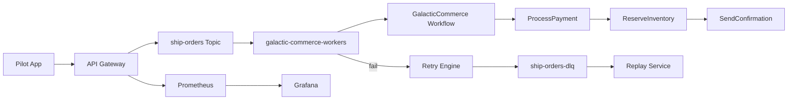

# EventFlow Demo Guide — Galactic Commerce

> **v1.0.0** — Primary demo docs: [demo/demo-script.md](demo/demo-script.md) · [demo/recording-guide.md](demo/recording-guide.md)

A zero-setup demo for recruiting presentations (3–5 minutes).

## Theme

**Galactic Commerce** — a pilot purchases the *Falcon-X* spaceship for 45,000 credits.

## Architecture



## Quick Start

### Windows (recommended for screen recording)

```powershell
.\scripts\demo.ps1
```

Runs all 10 acts automatically: architecture, URLs, publish, workflow watch, failure, retries, DLQ, replay, success, Grafana.

```powershell
.\scripts\demo.ps1 -SkipStackStart   # stack already running
```

### Bash

```bash
./scripts/demo.sh
./scripts/demo-failure.sh
./scripts/demo-replay.sh
go run ./cmd/demo-generator --events=1000 --failures=10
```

## Demo Script (5 minutes)

| Step | Action | Talking Point |
|------|--------|---------------|
| 1 | `./scripts/demo.sh` | "EventFlow is our event platform — one command starts everything" |
| 2 | Open Grafana `http://localhost:3000` | "Real-time metrics — events/sec, lag, retries" |
| 3 | Show REST `POST /api/v1/events` | "Idempotent publishing with Kafka durability" |
| 4 | `./scripts/demo-failure.sh` | "When inventory fails, we retry 3x then DLQ" |
| 5 | Show compensation logs | "Saga pattern — RefundPayment rolls back payment" |
| 6 | `./scripts/demo-replay.sh` | "Replay failed events after fixing the bug" |

## URLs

| Service | URL |
|---------|-----|
| REST API | http://localhost:8080 |
| Grafana | http://localhost:3000 (admin/admin) |
| Prometheus | http://localhost:9091 |
| Consumer metrics | http://localhost:8082/metrics |

## Sample Event

```json
{
  "topic": "ship-orders",
  "eventType": "ShipPurchased",
  "idempotencyKey": "ship-123",
  "payload": {
    "pilotId": 42,
    "shipId": "falcon-x",
    "credits": 45000
  }
}
```

## Workflow: GalacticCommerce

```
ShipPurchased → ProcessPayment → ReserveInventory → SendConfirmation
                     ↓ compensate
                RefundPayment
```

## Failure Scenario

1. Event published with `"simulateFailure": true`
2. Consumer fails → **Retry 1, 2, 3** (exponential backoff)
3. After max retries → **ship-orders-dlq**
4. Separate workflow run with `"demoFailStep": "ReserveInventory"`
5. **RefundPayment** compensation executes (LIFO saga)

## Replay Explanation

`demo-replay.sh` calls `POST /api/v1/replay` with `dlqOnly: true`, re-publishing DLQ messages to `ship-orders`. A clean workflow run completes all three steps.

## Expected Screenshots

1. **demo.sh terminal** — "Demo Ready" with URLs
2. **Grafana EventFlow Demo Dashboard** — Events/sec spike, workflow success gauge
3. **demo-failure.sh** — DLQ JSON + workflow status `failed` / `compensating`
4. **demo-replay.sh** — workflow status `completed`

## Generator Options

```bash
go run ./cmd/demo-generator \
  --events=1000 \
  --failures=10 \
  --throughput=50 \
  --replay=5
```

| Flag | Description |
|------|-------------|
| `--events` | Total events to publish |
| `--failures` | % with `simulateFailure` |
| `--throughput` | Events per second cap |
| `--replay` | % — replay DLQ after generation |
